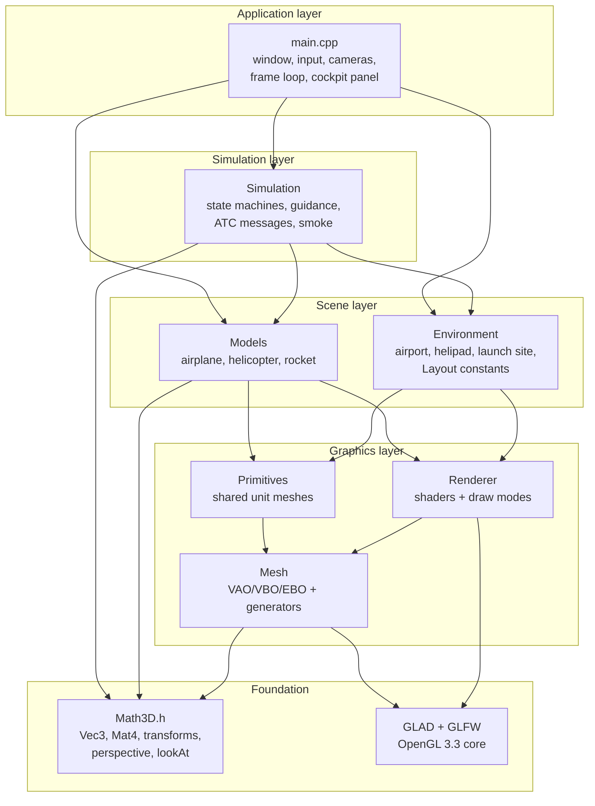
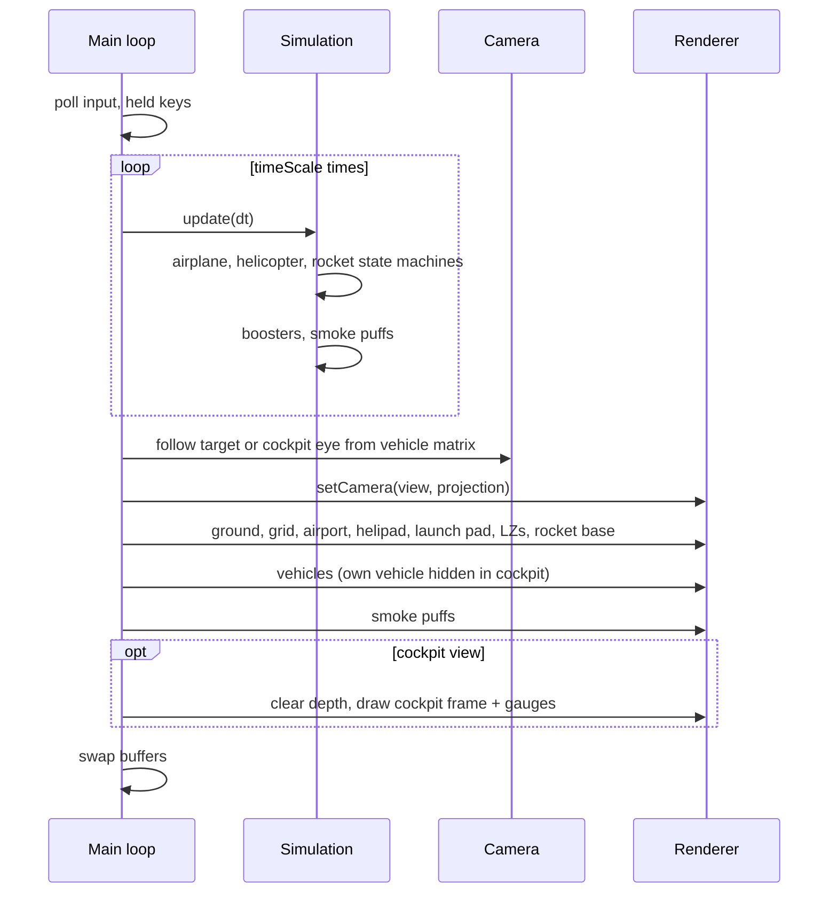
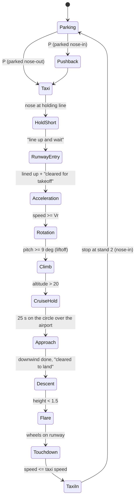
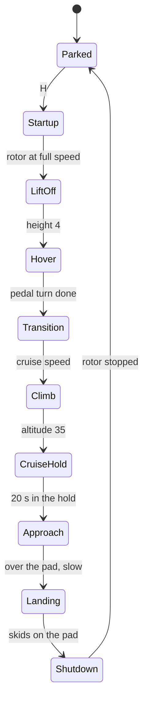
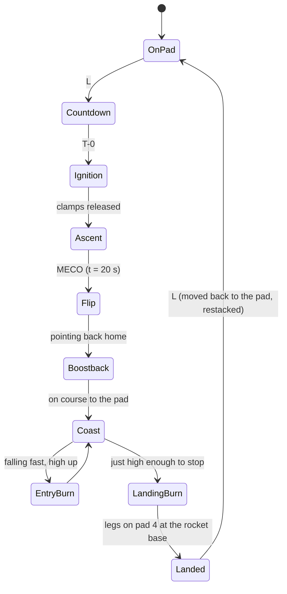

# Airport ATC Simulation — OpenGL 3.3

An interactive 3D simulation of an airport with **Air Traffic Control (ATC)**. Three vehicles fly complete, realistic cycles:

- an **airplane** taxis, takes off, holds, lands and parks
- a **helicopter** lifts off from a helipad and lands back on it
- a **reusable rocket** launches, and its boosters and core fly back and land at the airport

Written in modern C++17 with the OpenGL 3.3 core profile, GLFW and GLAD. There are no other libraries: all math, geometry and simulation are implemented from scratch.

> Course project for **CSE 4102**. The current stage is geometry, transformations and motion without colour or lighting, so the scene is drawn in grey levels. Colour and lighting are planned next (see [Extending: colour & lighting](#12-extending-colour--lighting)).

---

## Table of contents

1. [Features](#1-features)
2. [Quick start](#2-quick-start)
3. [Controls](#3-controls)
4. [Architecture](#4-architecture)
5. [Rendering pipeline](#5-rendering-pipeline)
6. [World layout & coordinate system](#6-world-layout--coordinate-system)
7. [Hierarchical modelling](#7-hierarchical-modelling)
8. [Simulation & ATC](#8-simulation--atc)
9. [Cameras](#9-cameras)
10. [Computer graphics concepts demonstrated](#10-computer-graphics-concepts-demonstrated)
11. [Tuning parameters](#11-tuning-parameters)
12. [Extending: colour & lighting](#12-extending-colour--lighting)
13. [Project structure](#13-project-structure)
14. [Troubleshooting](#14-troubleshooting)
15. [Known limitations & roadmap](#15-known-limitations--roadmap)

---

## 1. Features

### Vehicles

| Vehicle | Full cycle |
|---|---|
| ✈️ **Airplane** (twin-engine airliner) | Parking → *Pushback* → Taxi → Hold Short → Runway Entry (line-up) → Acceleration → Rotation → Climb (gear retracts) → Cruise/Hold → Approach (downwind, base) → Descent (localizer + glide slope, gear down) → Flare → Touchdown → Taxi In → Parking (nose-in) |
| 🚁 **Helicopter** | Parked → Engine start (rotor spool-up) → Lift-off → Hover (pedal turn) → Transition (nose down) → Climb → Cruise/Hold → Approach (decelerating, nose up) → Landing (vertical) → Shutdown |
| 🚀 **Rocket** (reusable, two side boosters) | Countdown (service arms swing away) → Ignition → Liftoff → Gravity turn → **Booster separation** (boosters fly back to LZ-1 / LZ-2) → Main engine cut-off → Flip → Boostback burn → Coast → Entry burn → Landing burn (legs deploy) → Landed on pad 4 of the **rocket base**, between two recovered rockets |

### Airport environment

- **Runway 09/27** with:
  - markings: threshold stripes, designators, aiming point, touchdown zone, centreline, edges
  - edge, threshold and approach lights, and blast pads
- **Parallel taxiway** with three connectors, holding-position lines, a centreline and edge lights.
- **Apron** with three numbered stands (lead-in lines and stop bars), a **terminal** building and **jet bridges**.
- **ATC tower** with a glass cab and a rotating radar antenna.
- **Helipad** with an "H", a touchdown ring, perimeter lights and a windsock.
- **Launch complex**:
  - an octagonal pad with a ramp and flame trench
  - the launch mount, a lattice service tower with swing-away arms, and a propellant tank
- **Two booster landing zones**, LZ-1 and LZ-2.
- **Rocket base** east of the launch pad: three landing pads (3, 4, 5) and a recovery hangar. Two recovered rockets stand on pads 3 and 5; pad 4 is kept free for the returning rocket.

### Effects, ATC and cameras

- **Effects:** engine flames with flicker, exhaust smoke trails, a launch/landing ground cloud, and vibration at ignition.
- **ATC radio:** clearances and pilot calls are printed in the console, for example *"Runway 09, cleared for takeoff"*, *"Join left downwind"* and *"Cleared to land"*.
- **Cameras:**
  - overview and fixed views
  - an orbit/follow camera for each vehicle
  - a **cockpit view** with working instruments
  - an onboard camera on the rocket
- **Simulation speed** of ×1, ×2, ×4 or ×8, pause, **wireframe** mode, and reset.

---

## 2. Quick start

### Prerequisites

| Tool | Version used |
|---|---|
| C++ compiler | MinGW-w64 GCC (C++17) |
| CMake | ≥ 3.20 |
| GPU driver | OpenGL 3.3 core |

GLFW (pre-built, in `glfw/`) and GLAD 2 (generated for `gl:core=3.3`, in `include/` + `src/gl.c`) are bundled, so nothing else needs to be installed.

### Build & run (PowerShell, from the project folder)

```powershell
# first time only: configure
cmake -S . -B build -G "MinGW Makefiles"

# build and run
cmake --build build
.\build\OpenGLProject.exe
```

The build copies `glfw3.dll` next to the executable automatically.

**Quick demo:** press **Enter** to start all three vehicles, **+** a few times to speed up time, and **0 / 1 / 2 / 3** to switch cameras.

---

## 3. Controls

| Key | Action |
|---|---|
| **P** | Airplane: start the cycle (taxi → take off → hold → land → park). Press again after parking for pushback and a new departure |
| **H** | Helicopter: start the cycle (take off → hold → land on the helipad) |
| **L** | Rocket: countdown and launch. After everything has landed, press again to move it back to the launch pad and relaunch |
| **Enter** | Start all three |
| **R** | Reset everything |
| **0** | Overview of the whole airport |
| **1 / 2 / 3** | Follow the airplane / helicopter / rocket |
| **4 / 5 / 6** | Runway view / ATC tower view / Rocket base view |
| **C** | Cockpit view of the followed vehicle (on/off) |
| Mouse drag / Arrow keys | Orbit the camera. In the cockpit: look around 360° (out of the side windows, back at your own aircraft, down at the airport) |
| Scroll / W, S | Zoom (in the cockpit: field of view 30°–100°)|
| **V** | Cockpit: look straight ahead again, normal zoom |
| **F** | Wireframe ↔ solid |
| **Space** | Pause / resume |
| **+ / −** | Simulation speed ×1 / ×2 / ×4 / ×8 |
| **Esc** | Quit |

The **window title** shows the current state, speed and altitude of every vehicle. The **console** shows the ATC and pilot radio messages.

---

## 4. Architecture

### 4.1 Layered design

The code is split into layers. Each layer only depends on the layers below it.



**Key design decisions**

- **Separation of simulation and drawing.**
  - `Simulation` only knows positions, orientations and states, and makes no OpenGL calls.
  - It exposes a *world matrix* for each vehicle, for example `airplaneMatrix()` or `boosterMatrix(i)`.
  - `main.cpp` passes that matrix to the drawing functions.
- **One set of shared primitives.** Every object in the world is built by transforming 12 unit-sized meshes, which are uploaded to the GPU once.
- **Data-driven layout.** All positions of airport facilities live in `namespace Layout` (`Environment.h`). The simulation's routes and targets are derived from those constants, so moving the helipad also moves the helicopter's landing target.
- **Tuning in one place.** Speeds, times and distances are named constants at the top of `Simulation.cpp`.

### 4.2 Modules

| Module | Files | Responsibility |
|---|---|---|
| **Math3D** | `Math3D.h` | `Vec3`, column-major `Mat4`, `translate` / `rotate` / `scale`, `perspective`, `lookAt`, `transformPoint` |
| **Mesh** | `Mesh.h/.cpp` | GPU upload (VAO/VBO/EBO) and procedural generators: cube, sphere, cylinder/cone/frustum, tube (ring), tapered wing slab, grid |
| **Primitives** | `Primitives.h/.cpp` | Creates the shared unit meshes once: `cube, sphere, cylinder, cone, frustum, frustumWide, octagon, ringThin, ringThick, wing, fin, smoke` |
| **Renderer** | `Renderer.h/.cpp` | GLSL shaders; `drawPart` (solid + outline edges), `drawSolid` (flames, smoke), `drawLines` (grid); wireframe mode |
| **Models** | `Models.h/.cpp` | Hierarchical models: airplane (folding gear), helicopter (rotors), rocket (boosters, flames, landing legs) |
| **Environment** | `Environment.h/.cpp` | `Layout` constants; ground, runway, taxiways, apron, terminal, tower, helipad, launch pad, booster landing zones, rocket base |
| **Simulation** | `Simulation.h/.cpp` | Vehicle state machines, guidance laws, ATC/pilot radio, rocket stage return, smoke particles |
| **Application** | `main.cpp` | GLFW window, input callbacks, orbit/follow/cockpit cameras, cockpit instrument panel, frame loop |

### 4.3 Frame loop



- **Fixed-size substeps.** `Simulation::update` clamps `dt` to 50 ms, and speed-up runs several substeps per frame. This keeps the motion stable at ×8.
- **Title bar.** It is refreshed five times per second with `Simulation::statusText()`.

---

## 5. Rendering pipeline

### 5.1 Geometry

```
MeshData (CPU)                         Mesh (GPU)
┌───────────────────────────┐          ┌─────────────────────────────────────┐
│ vertices: x y z nx ny nz  │  upload  │ VAO                                 │
│ indices:  triangles       │ ───────► │ VBO  (location 0 = pos, 1 = normal) │
│ edges:    outline pairs   │          │ EBO  [ triangle indices | edge idx ]│
└───────────────────────────┘          └─────────────────────────────────────┘
```

- **Unit size.** Every primitive fits inside a unit cube centred at the origin, so a model's `scale(...)` values equal the real size of the part.
- **Normals.** They are generated now, although this week's shaders don't use them yet. That lets lighting be added without changing any geometry.
- **Edges.** The EBO also stores a list of **outline edges**:
  - the four sides of each quad, with no triangle diagonals
  - a few meridians and parallels on spheres
  - the rims and a few side lines on cylinders

  Surfaces therefore read clearly without lighting.

### 5.2 Shaders

- **Vertex shader:** `gl_Position = uProjection * uView * uModel * vec4(aPos, 1)`.
- **Fragment shader:** outputs a single grey level, `uShade`. There is no colour or lighting yet.

### 5.3 Draw modes (`Renderer`)

| Call | Used for | How |
|---|---|---|
| `drawPart(mesh, model, shade)` | Almost everything | Pass 1: filled triangles with `glPolygonOffset` so they sit slightly behind. Pass 2: outline edges (`GL_LINES`) at `0.4 × shade` |
| `drawSolid(mesh, model, shade)` | Flames, smoke, gauge needles | Filled triangles only |
| `drawLines(mesh, model)` | Ground grid | `GL_LINES` |
| `wireframe = true` (key **F**) | Debug / demonstration | `glPolygonMode(GL_LINE)` shows every triangle |

- **Depth testing** is enabled, with 4× MSAA.
- **Painted markings** are thin boxes 0.02 units above the pavement, which avoids z-fighting.
- **Cockpit frame.** It is drawn after `glClear(GL_DEPTH_BUFFER_BIT)`, so the outside world can never poke through it.

---

## 6. World layout & coordinate system

- **Axes:** **+X** = east (runway 09 direction), **+Y** = up, **+Z** = south (towards the terminal). The ground is at `y = 0`.
- **Scale:** 1 unit ≈ 3.3 m (the airliner's fuselage is 12 units long).
- **Headings:** 0° = +X (east) and 90° = −Z (north), increasing counter-clockwise, so a positive turn is to the left.

```
            North (−Z)
   ┌─────────────────────────────────────────────────────────────────┐
   │   airplane holding circle over the airport (40, −10, r 150, alt 60) │
   │                                                                 │
   │  ══════════════════ RUNWAY 09/27  (z = −45, x −65..65) ════════ │
   │        ║ connector          ║ connector           ║ connector   │
   │  ══════╩════════════════════╩══ TAXIWAY (z = −14) ╩═══          │
   │        ┌──────── APRON (stands 1,2,3) ───┐                      │
   │        │   ✈ stand 2 (−20, 5.6)          │     ⊕ helipad        │
   │        └──[jet bridges]──────────────────┘       (32, 5)        │
   │        [======== TERMINAL (z 20..28) ====]  ▲ATC   ◆ launch pad  │
   │                                            (15,22)   (75, 12)   │
   │                          rocket base: pads 3 · 4 · 5 (125, 15)  │
   │                              LZ-2 (53, 44)       LZ-1 (97, 44)  │
   │        helicopter holding circle (centre 82, 115, r 60, alt 35) │
   └─────────────────────────────────────────────────────────────────┘
            South (+Z)            West (−X) ◄──────► East (+X)
```

All of these values are in `namespace Layout` in `src/Environment.h`.

---

## 7. Hierarchical modelling

Each vehicle is a **transformation hierarchy**:

- A `base` matrix from the simulation places the whole vehicle.
- Each part is `base × local transform × unit primitive`.
- Moving parts (rotors, landing gear, legs, service arms) add a **pivot rotation**: translate to the hinge, rotate, then translate back.

```cpp
// Helicopter main rotor: 4 blades spinning about the hub (rotation about Y)
Mat4 hub = base * translate(0.0f, 1.95f, 0.0f);
for (int i = 0; i < 4; ++i)
    r.drawPart(p.cube, hub * rotateY(rotorAngle + i * 90.0f)
                           * translate(2.25f, 0.0f, 0.0f) * scale(4.2f, 0.05f, 0.3f));

// Airplane main gear: hinged at the top of the strut, folds inward
Mat4 gear = base * translate(-0.2f, -0.45f, gz) * rotateX(side * fold)
                 * translate(0.2f, 0.45f, -gz);
```

The vehicle's own world matrix is built from its simulation state. For example, the airplane pitches about its main wheels, so the tail sinks during rotation:

```
airplane = T(position) · Ry(heading) · [T(pivot) · Rz(pitch) · T(−pivot)] · Rx(roll)
rocket   = T(position) · Rz(−tiltX) · Rx(tiltZ)
booster  = T(position) · Rz(−tiltX) · Rx(tiltZ) · Ry(index·180°)
```

---

## 8. Simulation & ATC

Each vehicle is a **finite state machine**. Every state updates position, orientation and speed, and decides the transition to the next state. State changes print ATC or pilot radio calls.

### 8.1 Airplane



| Technique | Where | Idea |
|---|---|---|
| **Pure-pursuit waypoints** | Taxi, taxi-in, approach | Steer towards the next waypoint at a limited turn rate. A waypoint counts as reached when close by or when it falls behind the aircraft |
| **Line tracking** | Final segment before a stop | Aim 3 units ahead along the painted line, so the aircraft stops straight on it |
| **Runway centreline lock** | Line-up, takeoff roll, rollout | Heading = `k · (z − runwayZ)`, limited to a few degrees |
| **Orbit guidance** | Holding patterns | Heading = tangent to the circle, corrected by the radius error |
| **Localizer** | Final approach | Intercept heading proportional to the lateral offset (up to 45°) |
| **Glide slope** | Final approach | Target altitude = distance to the aiming point × tan 5° |
| **Coordinated turns** | All flight | Bank angle follows the turn rate; pitch = flight-path angle + angle of attack, which is higher at low speed |
| **Gear retraction** | Climb | The gear folds up over 3 s once above 3 units |

### 8.2 Helicopter



- **Pitch follows acceleration.** Speeding up tilts the nose down and slowing down raises it (a flare).
- **Speed on approach.** Speed and altitude scale with the distance to the pad.
- **Final descent.** It only descends once it is facing its parked heading.

### 8.3 Rocket (reusable)



- **Side boosters.** They separate at *t* = 10 s. Each becomes its own `StageMotion` and flies Flip → Boostback → Coast → Landing Burn to **LZ-1 / LZ-2**.
- **Core.** It returns to the **rocket base** and lands on the free pad 4 (`ROCKET_BASE_FREE_PAD`), between the two recovered rockets on pads 3 and 5, blowing dust across the pad.
- **Boostback targeting.** The required sideways velocity is `distance to target ÷ predicted fall time`, and the engine pushes the stage towards it.
- **Landing burn ("suicide burn").** It starts at height `v² / 2(a − g)`. The allowed descent speed is `√(2(a − g)·h)`, so the stage reaches zero speed at the pad.
- **Result.** In testing all three stages touch down within 0.3 units of their targets at 1 unit/s.

### 8.4 ATC

The tower issues clearances in the correct operational order, for example:

```
[TOWER]  Airplane, hold short of runway 09.
[TOWER]  Airplane, runway 09, line up and wait.
[TOWER]  Airplane, wind calm, runway 09, cleared for takeoff.
[TOWER]  Airplane, leave the hold, join left downwind runway 09.
[TOWER]  Airplane, runway 09, wind calm, cleared to land.
```

Traffic is separated **vertically**: the airplane holds at 60 over the airport and the helicopter holds at 35 south of the helipad.

---

## 9. Cameras

| Camera | How it works |
|---|---|
| **Orbit / fixed** (0, 4, 5) | Spherical coordinates (yaw, pitch, distance) around a target, turned into a view matrix with `lookAt` |
| **Follow** (1, 2, 3) | Same orbit camera, with the target updated every frame to the vehicle's position |
| **Cockpit** (C) | The eye point and look direction are defined **in vehicle coordinates** and transformed by the vehicle's model matrix, so the view pitches and banks with the aircraft. Head yaw/pitch let the pilot look all the way round with the arrows or mouse; from the hold, looking left and down shows the whole airport below. Around the eye the fuselage (or the helicopter cabin) is left out, so looking back shows the wings, engines and tail |
| **Rocket onboard** (3 then C) | Camera on the side of the upper stage looking down along the body and exhaust |

**Cockpit panel.** Its gauges read live simulation data:

- airspeed
- artificial horizon: the bar rotates with the roll and shifts with the pitch
- altitude
- compass

Projection: perspective, 45° field of view (cockpit: 60°, adjustable 30°–100°), near 0.5, far 5000.

---

## 10. Computer graphics concepts demonstrated

| Concept (proposal §7) | Where in the code |
|---|---|
| **Translation** | Every part placement; vehicle motion (`translate(pos)`) |
| **Rotation** | Heading, pitch and roll; spinning rotors and radar; folding gear and legs; swinging service arms; rocket flip |
| **Scaling** | Unit primitives scaled to part size; growing smoke puffs; flame length from thrust |
| **Hierarchical transforms** | Models built as `base × local`; pivot rotations for hinged parts |
| **Viewing transform** | Custom `lookAt`; orbit, follow and cockpit cameras |
| **Perspective projection** | Custom `perspective` matrix, adjustable field of view |
| **Depth testing** | `GL_DEPTH_TEST`; depth clear for the cockpit overlay; polygon offset for outlines |
| **Procedural geometry** | Spheres, cylinders, cones, tubes, swept wings and grids generated in code |
| **Animation** | Time-based state machines, particle-like smoke, flicker |
| **Lighting & shading** | *Next stage.* Normals are already in every vertex (see §12) |

---

## 11. Tuning parameters

All of these are named constants at the top of `src/Simulation.cpp`.

| Constant | Default | Meaning |
|---|---|---|
| `TAXI_SPEED` | 4 | Taxi speed (units/s) |
| `TAKEOFF_ACCEL` / `ROTATE_SPEED` | 5 / 20 | Takeoff roll acceleration and Vr |
| `CLIMB_SPEED` / `CRUISE_SPEED` | 32 / 30 | Airborne speeds |
| `APPROACH_SPEED` / `TOUCHDOWN_SPEED` | 14 / 11 | Final approach and flare speeds |
| `GLIDE_SLOPE` / `FLARE_HEIGHT` | 5° / 1.5 | Approach path |
| `PLANE_HOLD_TIME` / `HELI_HOLD_TIME` | 25 s / 20 s | Time in the hold before landing |
| `PLANE_HOLD_ALT` / `HELI_ALTITUDE` | 60 / 35 | Holding altitudes |
| `BOOSTER_SEP_TIME` / `MECO_TIME` | 10 s / 20 s | Rocket event times after liftoff |
| `BOOSTBACK_ACCEL` / `LANDING_ACCEL` | 25 / 25 | Rocket engine accelerations |

Airport positions are in `namespace Layout` (`src/Environment.h`). Landing-leg geometry is in `CORE_LEGS` / `BOOSTER_LEGS` (`src/Models.h`).

---

## 12. Extending: colour & lighting

The code is prepared for the next stage:

1. **Normals** are already in every vertex (attribute location 1).
2. In `Renderer.cpp`, add a normal matrix and a light direction to the vertex shader, pass the normal to the fragment shader, and add Phong/Lambert shading.
3. Replace the `float shade` parameter of `drawPart` / `drawSolid` with a colour (`Vec3`). The grey levels in `Environment.cpp` (`namespace Shade`) map directly to materials:
   - asphalt, concrete, grass
   - paint markings (white / yellow)
   - glass and metal
4. Give the flames and smoke emissive or unlit colours, and add a sky colour with `glClearColor`.

None of the geometry, models or simulation code needs to change.

---

## 13. Project structure

```
OpenGL Project/
├── CMakeLists.txt          build configuration (C++17, GLFW, OpenGL)
├── README.md
├── include/
│   ├── glad/gl.h           GLAD 2 loader (OpenGL 3.3 core)
│   └── KHR/khrplatform.h
├── glfw/                   pre-built GLFW (headers + MinGW libs + DLL)
├── src/
│   ├── main.cpp            window, input, cameras, cockpit panel, frame loop
│   ├── Math3D.h            vectors, matrices, transforms, projection, lookAt
│   ├── Mesh.h / .cpp       GPU meshes + procedural primitive generators
│   ├── Primitives.h / .cpp shared unit meshes
│   ├── Renderer.h / .cpp   shaders and draw modes
│   ├── Models.h / .cpp     airplane, helicopter, rocket (+ boosters, legs)
│   ├── Environment.h / .cpp airport layout and all facilities
│   ├── Simulation.h / .cpp state machines, guidance, ATC, rocket return, smoke
│   └── gl.c                GLAD implementation
└── build/                  CMake build output (OpenGLProject.exe)
```

---

## 14. Troubleshooting

| Problem | Fix |
|---|---|
| `cannot open output file OpenGLProject.exe: Permission denied` | The program is still running. Close its window, then build again |
| `glfw3.dll not found` when starting | Run the executable from `build/` (the DLL is copied there during the build) |
| Black window / "Failed to create GLFW window" | The GPU or driver doesn't support OpenGL 3.3 core. Update the graphics driver |
| CMake uses the wrong generator | Delete `build/` and configure again with `-G "MinGW Makefiles"` |
| A cycle takes too long to watch | Press **+** for ×2 / ×4 / ×8 simulation speed |

---

## 15. Known limitations & roadmap

**Limitations (deliberate simplifications)**

- **Kinematic motion.** Flight dynamics are simplified guidance laws, not an aerodynamic model.
- **Fixed ATC timing.** Clearances follow fixed timers and routes; there is no runway-occupancy queue between multiple aircraft yet.
- **One vehicle of each type,** and landings on runway 09 only.
- **No collision detection** between vehicles and structures. Routes are laid out so vehicles don't intersect.

**Roadmap**

- [ ] Colour, materials and Phong lighting (next stage)
- [ ] ATC runway-occupancy queue with several aircraft and priorities
- [ ] Landings on runway 27, chosen by wind direction
- [ ] On-screen HUD text (state, ATC instruction)
- [ ] Textured ground, sky gradient and runway lights that light up at night
