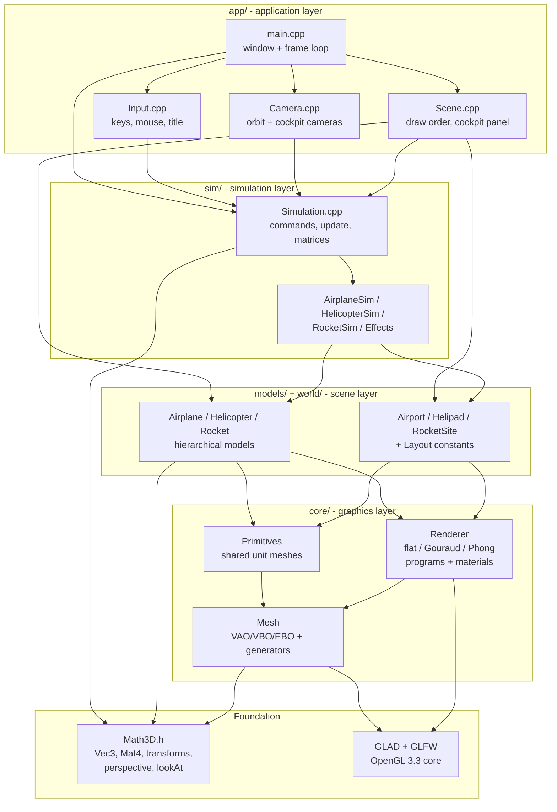
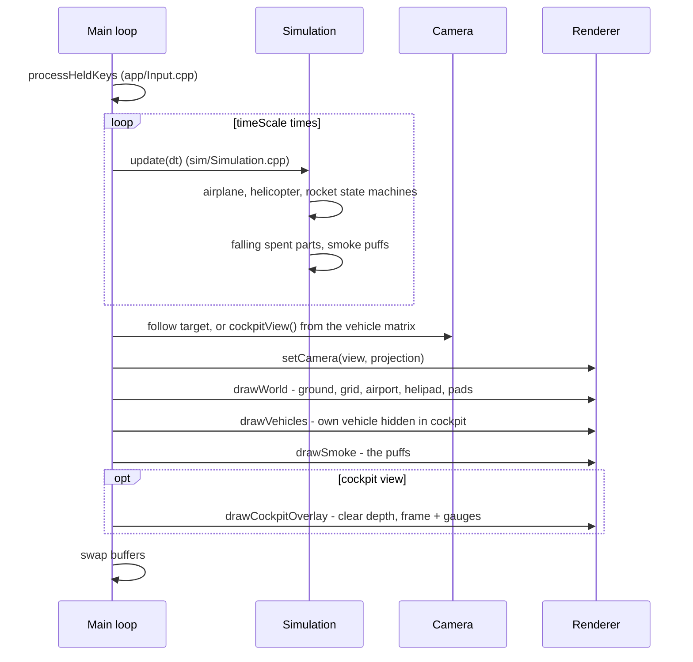
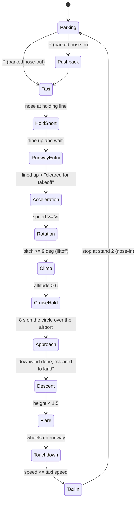
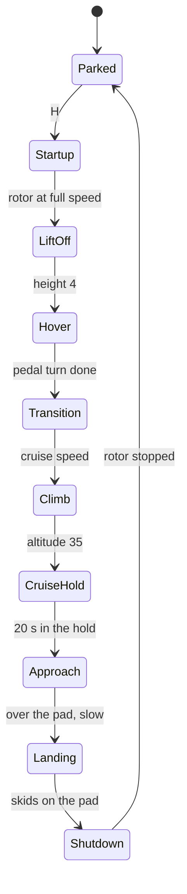
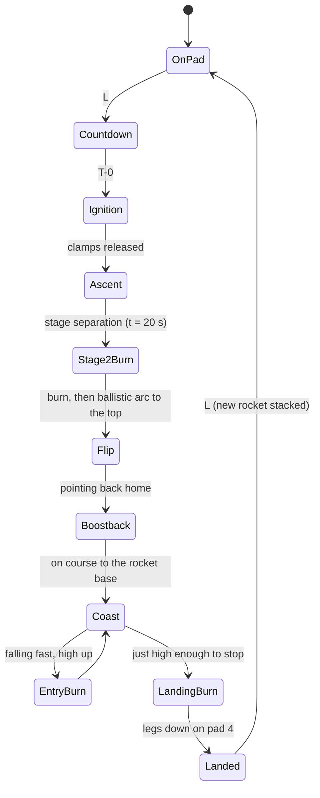

# Airport ATC Simulation — OpenGL 3.3

An interactive 3D simulation of an airport with **Air Traffic Control (ATC)**. Three vehicles fly complete, realistic cycles:

- an **airplane** taxis, takes off, holds, lands and parks
- a **helicopter** lifts off from a helipad and lands back on it
- a **rocket** launches and separates twice; the spent parts fall away and the final stage flies back and lands at the airport

Written in modern C++17 with the OpenGL 3.3 core profile, GLFW and GLAD. There are no other libraries: all math, geometry and simulation are implemented from scratch.

> Course project for **CSE 4102**. Geometry, transformations and motion, now with colour and lighting: the same scene can be drawn flat, with **Gouraud** (per-vertex) or with **Phong** (per-pixel) shading, switched with a key while it runs (see [Colour & materials](#12-colour--materials) and [Shaders](#52-shaders-three-programs-one-formula)).

---

## Table of contents

1. [Features](#1-features)
2. [Quick start](#2-quick-start)
3. [Controls](#3-controls)
4. [Architecture](#4-architecture)
5. [Rendering pipeline](#5-rendering-pipeline)
6. [World layout & coordinate system](#6-world-layout--coordinate-system)
7. [Hierarchical modelling](#7-hierarchical-modelling)
8. [Simulation & ATC](#8-simulation--atc)
9. [Cameras](#9-cameras)
10. [Computer graphics concepts demonstrated](#10-computer-graphics-concepts-demonstrated)
11. [Tuning parameters](#11-tuning-parameters)
12. [Colour & materials](#12-colour--materials)
13. [Project structure](#13-project-structure)
14. [Troubleshooting](#14-troubleshooting)
15. [Known limitations & roadmap](#15-known-limitations--roadmap)

---

## 1. Features

### Vehicles

| Vehicle | Full cycle |
|---|---|
| ✈️ **Airplane** (twin-engine airliner) | Parking → *Pushback* → Taxi → Hold Short → Runway Entry (line-up) → Acceleration → Rotation → Climb (gear retracts) → Cruise/Hold → Approach (downwind, base) → Descent (localizer + glide slope, gear down) → Flare → Touchdown → Taxi In → Parking (nose-in) |
| 🚁 **Helicopter** | Parked → Engine start (rotor spool-up) → Lift-off → Hover (pedal turn) → Transition (nose down) → Climb → Cruise/Hold → Approach (decelerating, nose up) → Landing (vertical) → Shutdown |
| 🚀 **Rocket** (two stages + two side boosters) | Countdown (service arms swing away) → Ignition → Liftoff → Gravity turn → **Booster separation** (the empty boosters fall away) → **Stage separation** (the empty first stage falls away) → the second stage lights its own engine, flies a faster, higher trajectory, then flips, burns back and lands on pad 4 of the **rocket base** |

### Airport environment

- **Runway 09/27** with:
  - markings: threshold stripes, designators, aiming point, touchdown zone, centreline, edges
  - edge, threshold and approach lights, and blast pads
- **Parallel taxiway** with three connectors, holding-position lines, a centreline and edge lights.
- **Apron** with three numbered stands (lead-in lines and stop bars), a **terminal** building and **jet bridges**.
- **ATC tower** with a glass cab and a rotating radar antenna.
- **Helipad** with an "H", a touchdown ring, perimeter lights and a windsock.
- **Launch complex**:
  - an octagonal pad with a ramp and flame trench
  - the launch mount, a lattice service tower with swing-away arms, and a propellant tank
- **Rocket base** east of the launch pad: three landing pads (3, 4, 5) and a recovery hangar. Two recovered rockets stand on pads 3 and 5; pad 4 is kept free for the returning rocket.

### Effects, ATC and cameras

- **Effects:** engine flames with flicker and vibration at ignition; a launch/landing ground cloud; and smoke from all three vehicles — the rocket's white exhaust trail, the airliner's sooty plume at takeoff power that turns into a white contrail once it is up, and the puff of burnt rubber when its wheels touch down.
- **ATC radio:** clearances and pilot calls are printed in the console, for example *"Runway 09, cleared for takeoff"*, *"Join left downwind"* and *"Cleared to land"*.
- **Cameras:**
  - overview and fixed views
  - an orbit/follow camera for each vehicle
  - a **cockpit view** with working instruments
  - an onboard camera on the rocket
- **Lighting and colour:** one directional sun the user can move around and raise, three shading models to switch between while the simulation runs (flat, Gouraud, Phong), and a material palette per surface.
- **Simulation speed** of ×1, ×2, ×4 or ×8, pause, **wireframe** mode, and reset.

---

## 2. Quick start

### Prerequisites

| Tool | Version used |
|---|---|
| C++ compiler | MinGW-w64 GCC (C++17) |
| CMake | ≥ 3.20 |
| GPU driver | OpenGL 3.3 core |

GLFW (pre-built, in `glfw/`) and GLAD 2 (generated for `gl:core=3.3`, in `include/` + `src/core/gl.c`) are bundled, so nothing else needs to be installed.

### Build & run (PowerShell, from the project folder)

```powershell
# first time only: configure
cmake -S . -B build -G "MinGW Makefiles"

# build and run
cmake --build build
.\build\OpenGLProject.exe
```

The build copies `glfw3.dll` next to the executable automatically.

**Quick demo:** press **Enter** to start all three vehicles, **+** a few times to speed up time, and **0 / 1 / 2 / 3** to switch cameras.

---

## 3. Controls

| Key | Action |
|---|---|
| **P** | Airplane: start the cycle (taxi → take off → hold → land → park). Press again after parking for pushback and a new departure |
| **M** | **Fly the airplane yourself.** On the ground it is lined up on runway 09; in the air you take over where it is. Press again to hand it back: in the air the autopilot holds, lands and parks; on the ground it is towed to stand 2 |
| **I / K** (manual) | Throttle up / down |
| **8 / 5** (manual) | Climb / descend (on the runway: 8 above 20 rotates and lifts off). Top row or numpad; while flying, 4 / 5 / 6 do not change the view |
| **4 / 6** (manual) | Bank left / right (on the ground: nose-wheel steering) |
| Arrows, W / S (manual) | Still the camera — orbit and zoom to watch the runway during take-off and landing |
| **U** (manual) | Landing gear up / down |
| **X** (manual) | Wheel brakes |
| **H** | Helicopter: start the cycle (take off → hold → land on the helipad) |
| **L** | Rocket: countdown and launch. After everything has landed, press again to move it back to the launch pad and relaunch |
| **Enter** | Start all three |
| **R** | Reset everything |
| **0** | Overview of the whole airport |
| **1 / 2 / 3** | Follow the airplane / helicopter / rocket (after stage separation: the second stage) |
| **4 / 5 / 6** | Runway view / ATC tower view / Rocket base view |
| **C** | Cockpit view of the followed vehicle (on/off) |
| **N** (or F1) | Shading: **none** — flat colours, no lighting |
| **G** (or F2) | Shading: **Gouraud** — lighting computed per vertex |
| **B** (or F3) | Shading: **Phong** — lighting computed per pixel (default) |
| **[ / ]** | Swing the sun around the airport (tap = 10°, hold = continuous) |
| **; / '** | Lower / raise the sun (8°–89° above the horizon) |
| Mouse drag / Arrow keys | Orbit the camera. In the cockpit: look around 360° (out of the side windows, back at your own aircraft, down at the airport) |
| Scroll / W, S | Zoom (in the cockpit: field of view 30°–100°)|
| **V** | Cockpit: look straight ahead again, normal zoom |
| **F** | Wireframe ↔ solid |
| **Space** | Pause / resume |
| **+ / −** | Simulation speed ×1 / ×2 / ×4 / ×8 |
| **Esc** | Quit |

The **window title** shows the selected shading model, the current state, speed
and altitude of every vehicle. The **console** shows the ATC and pilot radio
messages.

**Seeing Gouraud and Phong apart.** Both use exactly the same lighting formula,
so the diffuse (matte) part of the picture looks identical; they differ where a
*highlight* falls inside a polygon. The clearest place to look:

1. Press **1** to follow the airplane and **W** a few times to zoom in on it.
2. Press **B** (Phong): a bright highlight runs along the top of the fuselage,
   and the sun's sheen lies on the apron.
3. Press **G** (Gouraud): both disappear. The fuselage is a cylinder with
   vertices only at its two ends and the apron is a single large quad, so a
   highlight in the middle of them cannot be stored at the vertices.
4. Hold **]** to swing the sun: under Phong the highlight glides, under Gouraud
   it jumps from vertex to vertex.

---

## 4. Architecture

### 4.1 Layered design

The code is split into layers, one folder per layer. Each layer only depends
on the layers below it.


```mermaid
flowchart TB
    subgraph APP["app/ - application layer"]
        MAIN["main.cpp<br/>window + frame loop"]
        INPUT["Input.cpp<br/>keys, mouse, title"]
        CAM["Camera.cpp<br/>orbit + cockpit cameras"]
        SCN["Scene.cpp<br/>draw order, cockpit panel"]
    end
    subgraph LOGIC["sim/ - simulation layer"]
        SIM["Simulation.cpp<br/>commands, update, matrices"]
        VEH["AirplaneSim / HelicopterSim /<br/>RocketSim / Effects"]
    end
    subgraph SCENE["models/ + world/ - scene layer"]
        MOD["Airplane / Helicopter / Rocket<br/>hierarchical models"]
        ENV["Airport / Helipad / RocketSite<br/>+ Layout constants"]
    end
    subgraph GFX["core/ - graphics layer"]
        PRIM["Primitives<br/>shared unit meshes"]
        REN["Renderer<br/>flat / Gouraud / Phong<br/>programs + materials"]
        MESH["Mesh<br/>VAO/VBO/EBO + generators"]
    end
    subgraph BASE["Foundation"]
        MATH["Math3D.h<br/>Vec3, Mat4, transforms,<br/>perspective, lookAt"]
        GL["GLAD + GLFW<br/>OpenGL 3.3 core"]
    end

    MAIN --> INPUT
    MAIN --> CAM
    MAIN --> SCN
    MAIN --> SIM
    INPUT --> SIM
    CAM --> SIM
    SCN --> SIM
    SCN --> MOD
    SCN --> ENV
    SIM --> VEH
    VEH --> MOD
    VEH --> ENV
    MOD --> PRIM
    MOD --> REN
    ENV --> PRIM
    ENV --> REN
    PRIM --> MESH
    REN --> MESH
    MESH --> GL
    REN --> GL
    SIM --> MATH
    MOD --> MATH
    MESH --> MATH
```

**Key design decisions**

- **Separation of simulation and drawing.**
  - `Simulation` only knows positions, orientations and states, and makes no OpenGL calls.
  - It exposes a *world matrix* for each vehicle, for example `airplaneMatrix()` or `upperStageMatrix()`.
  - `app/Scene.cpp` passes that matrix to the drawing functions.
- **One set of shared primitives.** Every object in the world is built by transforming 12 unit-sized meshes, which are uploaded to the GPU once.
- **Data-driven layout.** All positions of airport facilities live in `namespace Layout` (`world/Environment.h`). The simulation's routes and targets are derived from those constants, so moving the helipad also moves the helicopter's landing target.
- **Tuning in one place.** Speeds, times and distances are named constants in `sim/Tuning.h`, one block per vehicle.

### 4.2 Modules

| Module | Files | Responsibility |
|---|---|---|
| **Math3D** | `core/Math3D.h` | `Vec3`, column-major `Mat4`, `translate` / `rotate` / `scale`, `perspective`, `lookAt`, `transformPoint` |
| **Mesh** | `core/Mesh.h/.cpp` | GPU upload (VAO/VBO/EBO) and procedural generators: cube, sphere, cylinder/cone/frustum, tube (ring), tapered wing slab, grid |
| **Primitives** | `core/Primitives.h/.cpp` | Creates the shared unit meshes once: `cube, sphere, cylinder, cone, frustum, frustumWide, octagon, ringThin, ringThick, wing, fin, smoke` |
| **Renderer** | `core/Renderer.h/.cpp` | Three GLSL programs (flat, Gouraud, Phong) and the sun; `Material{color, gloss}`; `drawPart` (lit surface + outline edges), `drawSolid` (unlit flames, smoke), `drawLines` (grid); wireframe mode |
| **Models** | `models/Models.h`, `Airplane.cpp`, `Helicopter.cpp`, `Rocket.cpp` | One file per object: airplane (folding gear), helicopter (rotors), rocket (separable boosters and stages, flames, landing legs) |
| **Environment** | `world/Environment.h`, `SceneParts.h`, `Airport.cpp`, `Helipad.cpp`, `RocketSite.cpp` | `Layout` constants and the `Paint::` palette; ground, runway, taxiways, apron, terminal, tower, helipad, launch pad, rocket base |
| **Simulation** | `sim/Simulation.h`, `Tuning.h`, `Flight.h`, `Simulation.cpp`, `AirplaneSim.cpp`, `HelicopterSim.cpp`, `RocketSim.cpp`, `Effects.cpp` | One file per vehicle: state machines and guidance laws, plus ATC/pilot radio, the rocket stage return and the smoke particles |
| **Application** | `app/main.cpp`, `App.h`, `Camera.cpp`, `Input.cpp`, `Scene.cpp` | GLFW window and frame loop; input callbacks; orbit/follow/cockpit cameras; draw order and the cockpit instrument panel |

### 4.3 Frame loop


```mermaid
sequenceDiagram
    participant App as Main loop
    participant Sim as Simulation
    participant Cam as Camera
    participant R as Renderer
    App->>App: processHeldKeys (app/Input.cpp)
    loop timeScale times
        App->>Sim: update(dt) (sim/Simulation.cpp)
        Sim->>Sim: airplane, helicopter, rocket state machines
        Sim->>Sim: falling spent parts, smoke puffs
    end
    App->>Cam: follow target, or cockpitView() from the vehicle matrix
    App->>R: setCamera(view, projection)
    App->>R: drawWorld - ground, grid, airport, helipad, pads
    App->>R: drawVehicles - own vehicle hidden in cockpit
    App->>R: drawSmoke - the puffs
    opt cockpit view
        App->>R: drawCockpitOverlay - clear depth, frame + gauges
    end
    App->>App: swap buffers
```

The four `draw...` calls are the whole of `app/Scene.cpp`, in that order.

- **Fixed-size substeps.** `Simulation::update` clamps `dt` to 50 ms, and speed-up runs several substeps per frame. This keeps the motion stable at ×8.
- **Title bar.** It is refreshed five times per second with `Simulation::statusText()`.

---

## 5. Rendering pipeline

### 5.1 Geometry

```
MeshData (CPU)                         Mesh (GPU)
┌───────────────────────────┐          ┌─────────────────────────────────────┐
│ vertices: x y z nx ny nz  │  upload  │ VAO                                 │
│ indices:  triangles       │ ───────► │ VBO  (location 0 = pos, 1 = normal) │
│ edges:    outline pairs   │          │ EBO  [ triangle indices | edge idx ]│
└───────────────────────────┘          └─────────────────────────────────────┘
```

- **Unit size.** Every primitive fits inside a unit cube centred at the origin, so a model's `scale(...)` values equal the real size of the part.
- **Normals.** They are generated now, although this week's shaders don't use them yet. That lets lighting be added without changing any geometry.
- **Edges.** The EBO also stores a list of **outline edges**:
  - the four sides of each quad, with no triangle diagonals
  - a few meridians and parallels on spheres
  - the rims and a few side lines on cylinders

  Surfaces therefore read clearly without lighting.

### 5.2 Shaders: three programs, one formula

`Renderer::init` compiles **three** programs and the user picks between them at
run time (keys **N**, **G**, **B**). They are deliberately written to share the
same lighting formula so that only the *place* where it is evaluated differs.

| Program | Vertex shader | Fragment shader | Cost |
|---|---|---|---|
| **Flat** | position only | the material colour, unlit | lowest |
| **Gouraud** | runs the whole lighting formula, outputs `vec2(body, highlight)` | multiplies the interpolated values with the colour | one lighting calculation **per vertex** |
| **Phong** | passes the world position and the normal on | runs the whole lighting formula | one lighting calculation **per pixel** |

The formula is the Phong reflection model with one directional light (the sun):

```
N = normalize(normalMatrix * aNormal)     surface normal
L = normalize(uLightDir)                  direction to the sun
V = normalize(uViewPos - worldPos)        direction to the eye
R = reflect(-L, N)                        mirror direction of the light

diffuse  = max(dot(N, L), 0)              Lambert: facing the sun = bright
specular = max(dot(V, R), 0) ^ shininess  highlight: only near the mirror direction

colour = material * (ambient + uDiffuse * diffuse) + uSpecular * gloss * specular
```

- The highlight is **added as white light** instead of being multiplied by the
  material, so it also shows up on dark surfaces, exactly as a real one does.
- **The normal matrix.** Normals are transformed with `normalMatrix(model)` —
  the inverse transpose of the model matrix's upper-left 3×3 (`core/Math3D.h`).
  Without it a non-uniform scale (every painted marking is a flattened cube)
  would tilt the normals away from the surface and light it wrongly.
- **The eye position** for the specular term is read back out of the view
  matrix inside `setCamera`, so no caller has to pass it.
- **Materials.** `Material{color, gloss}` gives every surface its own colour
  *and* how strongly it reflects the highlight: grass 0.10 (matte), concrete
  0.30, glass 2.2, a polished fuselage 2.4. The palettes are
  `Paint::` (`world/SceneParts.h`) for the airport and `Livery::`
  (`models/ModelParts.h`) for the three vehicles.
- **The sun** is a `Light{direction, ambient, diffuse, specular, shininess}`.
  Its direction comes from an azimuth and an elevation the user moves with
  **[ ]** and **; '**.

### 5.3 Draw modes (`Renderer`)

| Call | Used for | How |
|---|---|---|
| `drawPart(mesh, model, material)` | Almost everything | Pass 1: filled triangles, lit with the selected shading model, with `glPolygonOffset` so they sit slightly behind. Pass 2: outline edges (`GL_LINES`), unlit, at `0.4 × colour` |
| `drawSolid(mesh, model, colour)` | Flames, smoke, gauge needles | Filled triangles only, always unlit: they glow by themselves |
| `drawLines(mesh, model)` | Ground grid | `GL_LINES` |
| `wireframe = true` (key **F**) | Debug / demonstration | `glPolygonMode(GL_LINE)` shows every triangle |

- **Depth testing** is enabled, with 4× MSAA.
- **Depth precision.** A depth buffer is not linear: almost all of its
  resolution sits close to the camera, and what it can still tell apart at a
  distance `z` is roughly `z² / (near · 2²⁴)`. From a rocket 1 500 units up
  that is a third of a unit, so two surfaces any closer than that flicker
  against each other in stripes. Two things keep it away:
  - the **near plane is as far out as the view allows** (1.0 outside, 0.3 in
    the cockpit, where the panel is only about a unit from the eye) — pushing
    it out is far more effective than pulling the far plane in;
  - the **ground is a 60-unit-deep slab**, not a thin sheet, so its top never
    meets its own underside in the depth buffer.
- **Painted markings** are thin boxes 0.02 units above the pavement, which avoids z-fighting.
- **Cockpit frame.** It is drawn after `glClear(GL_DEPTH_BUFFER_BIT)`, so the outside world can never poke through it.

---

## 6. World layout & coordinate system

- **Axes:** **+X** = east (runway 09 direction), **+Y** = up, **+Z** = south (towards the terminal). The ground is at `y = 0`.
- **Scale:** 1 unit ≈ 3.3 m (the airliner's fuselage is 12 units long).
- **Headings:** 0° = +X (east) and 90° = −Z (north), increasing counter-clockwise, so a positive turn is to the left.

```
            North (−Z)
   ┌─────────────────────────────────────────────────────────────────┐
   │   airplane holding circle over the airport (40, −10, r 70, alt 30)  │
   │                                                                 │
   │  ══════════════════ RUNWAY 09/27  (z = −45, x −65..65) ════════ │
   │        ║ connector          ║ connector           ║ connector   │
   │  ══════╩════════════════════╩══ TAXIWAY (z = −14) ╩═══          │
   │        ┌──────── APRON (stands 1,2,3) ───┐                      │
   │        │   ✈ stand 2 (−20, 5.6)          │     ⊕ helipad        │
   │        └──[jet bridges]──────────────────┘       (32, 5)        │
   │        [======== TERMINAL (z 20..28) ====]  ▲ATC   ◆ launch pad  │
   │                                            (15,22)   (75, 12)   │
   │                          rocket base: pads 3 · 4 · 5 (125, 15)  │
   │        helicopter holding circle (centre 82, 115, r 60, alt 35) │
   └─────────────────────────────────────────────────────────────────┘
            South (+Z)            West (−X) ◄──────► East (+X)
```

All of these values are in `namespace Layout` in `src/world/Environment.h`.

---

## 7. Hierarchical modelling

Each vehicle is a **transformation hierarchy**:

- A `base` matrix from the simulation places the whole vehicle.
- Each part is `base × local transform × unit primitive`.
- Moving parts (rotors, landing gear, legs, service arms) add a **pivot rotation**: translate to the hinge, rotate, then translate back.

```cpp
// Helicopter main rotor: 4 blades spinning about the hub (rotation about Y)
Mat4 hub = base * translate(0.0f, 1.95f, 0.0f);
for (int i = 0; i < 4; ++i)
    r.drawPart(p.cube, hub * rotateY(rotorAngle + i * 90.0f)
                           * translate(2.25f, 0.0f, 0.0f) * scale(4.2f, 0.05f, 0.3f));

// Airplane main gear: hinged at the top of the strut, folds inward
Mat4 gear = base * translate(-0.2f, -0.45f, gz) * rotateX(side * fold)
                 * translate(0.2f, 0.45f, -gz);
```

The vehicle's own world matrix is built from its simulation state. For example, the airplane pitches about its main wheels, so the tail sinks during rotation:

```
airplane = T(position) · Ry(heading) · [T(pivot) · Rz(pitch) · T(−pivot)] · Rx(roll)
rocket   = T(position) · Rz(−tiltX) · Rx(tiltZ)
spent part = T(fall offset) · (matrix at separation) · [T(pivot) · Rz(−tumble) · T(−pivot)]
```

---

## 8. Simulation & ATC

Each vehicle is a **finite state machine**. Every state updates position, orientation and speed, and decides the transition to the next state. State changes print ATC or pilot radio calls.

### 8.1 Airplane


```mermaid
stateDiagram-v2
    [*] --> Parking
    Parking --> Pushback: P (parked nose-in)
    Parking --> Taxi: P (parked nose-out)
    Pushback --> Taxi
    Taxi --> HoldShort: nose at holding line
    HoldShort --> RunwayEntry: "line up and wait"
    RunwayEntry --> Acceleration: lined up + "cleared for takeoff"
    Acceleration --> Rotation: speed >= Vr
    Rotation --> Climb: pitch >= 9 deg (liftoff)
    Climb --> CruiseHold: altitude > 6
    CruiseHold --> Approach: 8 s on the circle over the airport
    Approach --> Descent: downwind done, "cleared to land"
    Descent --> Flare: height < 1.5
    Flare --> Touchdown: wheels on runway
    Touchdown --> TaxiIn: speed <= taxi speed
    TaxiIn --> Parking: stop at stand 2 (nose-in)
```

| Technique | Where | Idea |
|---|---|---|
| **Pure-pursuit waypoints** | Taxi, taxi-in, approach | Steer towards the next waypoint at a limited turn rate. A waypoint counts as reached when close by or when it falls behind the aircraft |
| **Line tracking** | Final segment before a stop | Aim 3 units ahead along the painted line, so the aircraft stops straight on it |
| **Runway centreline lock** | Line-up, takeoff roll, rollout | Heading = `k · (z − runwayZ)`, limited to a few degrees |
| **Orbit guidance** | Holding patterns | Heading = tangent to the circle, corrected by the radius error |
| **Localizer** | Final approach | Intercept heading proportional to the lateral offset (up to 70°), so the short pattern is captured before touchdown |
| **Glide slope** | Final approach | Target altitude = **straight-line** distance to the aiming point × tan 7.5°. Using the real distance (not only the distance along the runway) keeps the aircraft high while it is still turning onto final |
| **Coordinated turns** | All flight | Bank angle follows the turn rate; pitch = flight-path angle + angle of attack, which is higher at low speed |
| **Gear retraction** | Climb | The gear folds up over 3 s once above 3 units |

**Manual flight** (key **M**, `sim/ManualFlight.cpp`). The same airliner can be
flown by hand at any time, with the autopilot cycle kept as it was. The flight
model treats the aircraft as a point mass moving along its flight path:

| Quantity | How it changes |
|---|---|
| Speed | `throttle · 7 − 0.005 · speed² − 9.8 · sin(climb angle)` per second (plus rolling friction and brakes on the ground). Full power levels off near 37 |
| Heading | Coordinated turn: `25°/s · tan(bank) / tan(30°)` — the same ratio the autopilot uses |
| Climb angle | Follows the stick at 12°/s and is held when the stick is released (trimmed). Below 12 units/s the wings stall and the nose drops by itself until speed returns |
| Lift-off | Only above the rotation speed (20) with the nose raised to 9° |
| Touchdown | Judged by the sink rate (smooth / firm / hard above 4), the gear (belly landing if up) and whether it is on the runway |

Handing back to the autopilot in the air puts the aircraft into the hold, from
where the normal approach and landing follow; on the ground it is towed back
to stand 2.

### 8.2 Helicopter


```mermaid
stateDiagram-v2
    [*] --> Parked
    Parked --> Startup: H
    Startup --> LiftOff: rotor at full speed
    LiftOff --> Hover: height 4
    Hover --> Transition: pedal turn done
    Transition --> Climb: cruise speed
    Climb --> CruiseHold: altitude 35
    CruiseHold --> Approach: 20 s in the hold
    Approach --> Landing: over the pad, slow
    Landing --> Shutdown: skids on the pad
    Shutdown --> Parked: rotor stopped
```

- **Pitch follows acceleration.** Speeding up tilts the nose down and slowing down raises it (a flare).
- **Speed on approach.** Speed and altitude scale with the distance to the pad.
- **Final descent.** It only descends once it is facing its parked heading.

### 8.3 Rocket (second stage returns)

The rocket separates **twice**: the empty side boosters at *t* = 10 s, then the empty first stage at *t* = 20 s. These spent parts have done their job: they fall away, slowly tumbling, and are removed once they reach the ground. Only the final part, the **second stage**, flies back and lands.


```mermaid
stateDiagram-v2
    [*] --> OnPad
    OnPad --> Countdown: L
    Countdown --> Ignition: T-0
    Ignition --> Ascent: clamps released
    Ascent --> Stage2Burn: stage separation (t = 20 s)
    Stage2Burn --> Flip: burn, then ballistic arc to the top
    Flip --> Boostback: pointing back home
    Boostback --> Coast: on course to the rocket base
    Coast --> EntryBurn: falling fast, high up
    EntryBurn --> Coast
    Coast --> LandingBurn: just high enough to stop
    LandingBurn --> Landed: legs down on pad 4
    Landed --> OnPad: L (new rocket stacked)
```

- **Booster separation (t = 10 s).** The two empty boosters are pushed off sideways and fall away (`Debris`).
- **Stage separation (t = 20 s).** The main engine cuts off, and the empty first stage falls away behind the rocket.
- **Second stage.** After a 1 s coast its own engine lights and it accelerates faster than the heavy first stage did, on a steep, lofted trajectory up to about 1,700 units high. It then flips, burns back, and lands on its own landing legs on the free pad 4 (`ROCKET_BASE_FREE_PAD`) of the **rocket base**, between the two recovered rockets on pads 3 and 5. The landing burn blows dust across the pad.
- **Boostback targeting.** The required sideways velocity is `distance to target ÷ predicted fall time`, and the engine pushes the stage towards it.
- **Landing burn ("suicide burn").** It starts at height `v² / 2(a − g)`. The allowed descent speed is `√(2(a − g)·h)`, so the stage reaches zero speed at the pad. Sideways, it brakes evenly too, so it stops right over the pad.
- **Result.** In testing, the second stage touches down within about 0.2 units of the pad centre at 1 unit/s.

### 8.4 ATC

The tower issues clearances in the correct operational order, for example:

```
[TOWER]  Airplane, hold short of runway 09.
[TOWER]  Airplane, runway 09, line up and wait.
[TOWER]  Airplane, wind calm, runway 09, cleared for takeoff.
[TOWER]  Airplane, leave the hold, join left downwind runway 09.
[TOWER]  Airplane, runway 09, wind calm, cleared to land.
```

The two holding circles do not overlap: the airplane holds at 30 over the airport (centre 40, −10, radius 70) and the helicopter at 35 south of the helipad (centre 82, 115, radius 60).

---

## 9. Cameras

| Camera | How it works |
|---|---|
| **Orbit / fixed** (0, 4, 5) | Spherical coordinates (yaw, pitch, distance) around a target, turned into a view matrix with `lookAt` |
| **Follow** (1, 2, 3) | Same orbit camera, with the target updated every frame to the vehicle's position |
| **Cockpit** (C) | The eye point and look direction are defined **in vehicle coordinates** and transformed by the vehicle's model matrix, so the view pitches and banks with the aircraft. Head yaw/pitch let the pilot look all the way round with the arrows or mouse; from the hold, looking left and down shows the whole airport below. Around the eye the fuselage (or the helicopter cabin) is left out, so looking back shows the wings, engines and tail |
| **Rocket onboard** (3 then C) | Camera on the side of the second stage looking down along the body and exhaust |

**Cockpit panel.** Its gauges read live simulation data:

- airspeed
- artificial horizon: the bar rotates with the roll and shifts with the pitch
- altitude
- compass

Projection: perspective, 45° field of view (cockpit: 60°, adjustable 30°–100°), near 0.5, far 5000.

---

## 10. Computer graphics concepts demonstrated

| Concept (proposal §7) | Where in the code |
|---|---|
| **Translation** | Every part placement; vehicle motion (`translate(pos)`) |
| **Rotation** | Heading, pitch and roll; spinning rotors and radar; folding gear and legs; swinging service arms; rocket flip |
| **Scaling** | Unit primitives scaled to part size; growing smoke puffs; flame length from thrust |
| **Hierarchical transforms** | Models built as `base × local`; pivot rotations for hinged parts |
| **Viewing transform** | Custom `lookAt`; orbit, follow and cockpit cameras |
| **Perspective projection** | Custom `perspective` matrix, adjustable field of view |
| **Depth testing** | `GL_DEPTH_TEST`; depth clear for the cockpit overlay; polygon offset for outlines |
| **Procedural geometry** | Spheres, cylinders, cones, tubes, swept wings and grids generated in code |
| **Animation** | Time-based state machines, particle-like smoke, flicker |
| **Lighting & shading** | One directional sun; **Gouraud** (per-vertex) and **Phong** (per-pixel) programs the user switches between, plus a flat/unlit mode (see §5.2) |
| **Normal transforms** | `normalMatrix` (inverse transpose) so non-uniform scaling does not break the lighting |
| **Materials & colour** | `Material{color, gloss}` with a palette per domain: `Paint::` for the airport, `Livery::` for the vehicles (see §12) |

---

## 11. Tuning parameters

All of these are named constants at the top of `src/sim/Tuning.h`.

| Constant | Default | Meaning |
|---|---|---|
| `TAXI_SPEED` | 4 | Taxi speed (units/s) |
| `TAKEOFF_ACCEL` / `ROTATE_SPEED` | 5 / 20 | Takeoff roll acceleration and Vr |
| `CLIMB_SPEED` / `CRUISE_SPEED` | 32 / 30 | Airborne speeds |
| `APPROACH_SPEED` / `TOUCHDOWN_SPEED` | 14 / 11 | Final approach and flare speeds |
| `GLIDE_SLOPE` / `FLARE_HEIGHT` | 7.5° / 1.5 | Approach path |
| `PLANE_HOLD_TIME` / `HELI_HOLD_TIME` | 8 s / 20 s | Time in the hold before landing |
| `PLANE_HOLD_ALT` / `HELI_ALTITUDE` | 30 / 35 | Holding altitudes |
| `PLANE_BANK` / `PLANE_TURN_RATE` | 30° / 25°/s | Bank angle and turn rate at full bank |
| `BOOSTER_SEP_TIME` / `STAGE_SEP_TIME` | 10 s / 20 s | Rocket separation times after liftoff |
| `STAGE2_BURN_TIME` / `STAGE2_ACCEL` / `STAGE2_MAX_TILT` | 8 s / 12 / 25° | Second stage burn and trajectory |
| `BOOSTBACK_ACCEL` / `LANDING_ACCEL` | 25 / 25 | Rocket engine accelerations |

Airport positions are in `namespace Layout` (`src/world/Environment.h`). Landing-leg geometry is in `CORE_LEGS` / `UPPER_LEGS` (`src/models/Models.h`).

---

## 12. Colour & materials

Every surface is a `Material`: its own colour plus a `gloss` factor that scales
the highlight. Nothing in the geometry, the models or the simulation knows
about colour — only the palettes do, so the whole airport is recoloured by
editing one table.

**`Paint::` — the airport** (`world/SceneParts.h`)

| Material | Colour | Gloss | Used for |
|---|---|---|---|
| `GRASS` | green | 0.10 | the field (matte: grass barely reflects) |
| `ASPHALT` / `TAXIWAY` | dark grey | 0.25 | runway, taxiways |
| `CONCRETE` | light grey | 0.30 | apron, helipad, landing pads |
| `MARKING` / `TAXILINE` | white / yellow | 0.45 | painted lines and digits |
| `BUILDING` / `ROOF` | warm grey / slate | 0.35, 0.50 | terminal, hangar, tower |
| `GLASS` | dark blue-green | 2.20 | windows (sharp reflections) |
| `METAL` | steel | 1.60 | masts, lattice tower, jet bridges |

**`Livery::` — the vehicles** (`models/ModelParts.h`)

| Vehicle | Scheme |
|---|---|
| Airplane | white fuselage (gloss 2.4), grey wings, deep blue fin, light nacelles, near-black tyres |
| Helicopter | rescue red cabin and boom, white tail surfaces, dark rotors, steel skids |
| Rocket | white stages, near-black interstage, grey nozzles and fins, steel landing legs |

Flames (orange) and smoke are drawn **unlit** with `drawSolid`, because they
emit light rather than receive it. Each puff carries the colour of whatever
produced it (`namespace Smoke` in `sim/Simulation.h`) and all of them cool
towards the same grey as they age:

| Smoke | Colour | Where |
|---|---|---|
| `ROCKET` | white | engine trail, pad cloud, landing dust |
| `EXHAUST` | dark grey | behind the jet engines near the ground |
| `CONTRAIL` | white | the same engines above 12 units, and it lingers ~4× longer |
| `TYRE` | light grey | thrown back from the main wheels on touchdown |

The sky is the clear colour in `app/main.cpp`.

---

## 13. Project structure

```
OpenGL Project/
├── CMakeLists.txt          build configuration (C++17, GLFW, OpenGL)
├── README.md
├── include/
│   ├── glad/gl.h           GLAD 2 loader (OpenGL 3.3 core)
│   └── KHR/khrplatform.h
├── glfw/                   pre-built GLFW (headers + MinGW libs + DLL)
├── src/
│   ├── app/                    the program itself
│   │   ├── main.cpp            window set-up and the frame loop
│   │   ├── App.h               AppState: camera, renderer, simulation, options
│   │   ├── Camera.h / .cpp     preset views, orbit camera, cockpit camera
│   │   ├── Input.h / .cpp      keyboard and mouse, window title, control list
│   │   └── Scene.h / .cpp      what is drawn each frame + cockpit panel
│   ├── core/                   graphics foundation
│   │   ├── Math3D.h            vectors, matrices, transforms, projection, lookAt
│   │   ├── Mesh.h / .cpp       GPU meshes + procedural primitive generators
│   │   ├── Primitives.h / .cpp the shared unit meshes
│   │   ├── Renderer.h / .cpp   shaders and draw modes
│   │   └── gl.c                GLAD implementation
│   ├── models/                 the three objects
│   │   ├── Models.h            drawing interface + leg geometry constants
│   │   ├── ModelParts.h        helpers shared by the models
│   │   ├── Airplane.cpp        fuselage, wings, engines, tail, folding gear
│   │   ├── Helicopter.cpp      cabin, boom, main and tail rotor, skids
│   │   └── Rocket.cpp          two stages, boosters, flames, landing legs
│   ├── world/                  the airport
│   │   ├── Environment.h       namespace Layout: every position and size
│   │   ├── SceneParts.h        Paint:: palette + box / marking / post / digit helpers
│   │   ├── Airport.cpp         ground, runway, taxiways, apron, terminal, tower
│   │   ├── Helipad.cpp         helipad and the round landing zone
│   │   └── RocketSite.cpp      launch pad with service tower, rocket base
│   └── sim/                    motion
│       ├── Simulation.h        states, per-vehicle data, the public interface
│       ├── Tuning.h            every tuned number (speeds, timings, altitudes)
│       ├── Flight.h            guidance helpers (steer, orbit, localizer, ...)
│       ├── Simulation.cpp      commands, update step, matrices, status line
│       ├── AirplaneSim.cpp     taxi, take-off, hold, approach, landing, parking
│       ├── ManualFlight.cpp    the user flies the airliner (key M): flight model
│       ├── HelicopterSim.cpp   lift-off, hover, cruise, vertical landing
│       ├── RocketSim.cpp       ascent, two separations, return and landing burn
│       └── Effects.cpp         smoke puffs, exhaust trails, falling parts
└── build/                      CMake build output (OpenGLProject.exe)
```

Each folder answers one question: `core/` *how do we draw anything?*, `models/`
*what do the three objects look like?*, `world/` *where is the airport?*,
`sim/` *how does everything move?* and `app/` *how does the user see it?*

---

## 14. Troubleshooting

| Problem | Fix |
|---|---|
| `cannot open output file OpenGLProject.exe: Permission denied` | The program is still running. Close its window, then build again |
| `glfw3.dll not found` when starting | Run the executable from `build/` (the DLL is copied there during the build) |
| Black window / "Failed to create GLFW window" | The GPU or driver doesn't support OpenGL 3.3 core. Update the graphics driver |
| CMake uses the wrong generator | Delete `build/` and configure again with `-G "MinGW Makefiles"` |
| A cycle takes too long to watch | Press **+** for ×2 / ×4 / ×8 simulation speed |
| Flickering stripes on a surface seen from far away | Depth-buffer precision. Push the near plane out (`app/main.cpp`) or give the surface more thickness — see §5.3 |

---

## 15. Known limitations & roadmap

**Limitations (deliberate simplifications)**

- **Kinematic motion.** Flight dynamics are simplified guidance laws, not an aerodynamic model.
- **Fixed ATC timing.** Clearances follow fixed timers and routes; there is no runway-occupancy queue between multiple aircraft yet.
- **One vehicle of each type,** and landings on runway 09 only.
- **One light, no shadows.** A single directional sun with ambient fill; nothing casts a shadow yet.
- **No collision detection** between vehicles and structures. Routes are laid out so vehicles don't intersect.

**Roadmap**

- [x] Colour, materials, and Gouraud + Phong lighting with a user-selected shading model
- [ ] ATC runway-occupancy queue with several aircraft and priorities
- [ ] Landings on runway 27, chosen by wind direction
- [ ] On-screen HUD text (state, ATC instruction)
- [ ] Textured ground, sky gradient and runway lights that light up at night
- [ ] Shadows (the sun already has a direction, so a shadow pass would fit straight in)
- [ ] Several lights: runway edge lamps and the rocket exhaust lighting the pad
